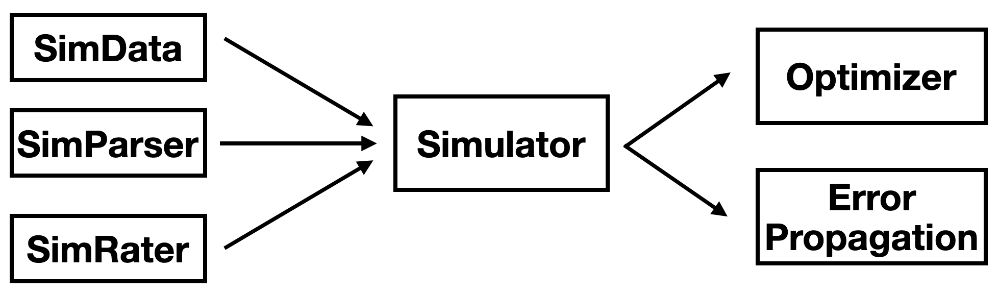

# PlasmaDM  
_A Python framework for modeling, optimizing, and propagating uncertainty in plasma-surface kinetics._

## Table of Contents

1. Introduction
4. Theoritical formulation
5. Project Structure

## Introduction

PlasmaDM provides a flexible, extensible platform to simulate plasma-surface reaction kinetics, fit model parameters to experimental data, and quantify uncertainty via Monte Carlo error propagation. With symbolic ODE construction under the hood, PlasmaDM makes it easy to explore new reaction mechanisms and optimization strategies.

## Theoretical formulation

#### Model Descritption and Observable

Now, we present a brief introduction to the theoretical formulation addressed on this paper.  The general formulation of the system corresponds to:
$$
\frac{d}{dt}\vec{y}(t) = \vec{F}(\vec{x}, \vec{y}(t);\theta), ~~ \vec{y}(t_0) = \vec{y}_0
$$

where

- $\vec{x}$: vector of the input experimental conditions (e.g. wall temperature, gas temperature, ...)

- $\vec{y}$: vector of species concentrations
- $\theta$: set of parameters that governs the surface kinetics (e.g. energy activation barrier, desorption frequencies, ...)
- $F(\cdot)$: system of chemical equations that model the surface and it is obatined from the kinetics scheme

The steady-state regime, corresponds to the condition: $d\vec{y}/dt = 0$

In our system, we are interested in modeling what we can categorize into two different types:

- **Linear** reactions (matrix $A$):

$$
B(g) + y_i \rightarrow y_j + C(g) \newline
y_i \rightarrow y_j + C(g)
$$

They correspond to the mechanims such as adsorption, where a gas specie, $B(g)$, adhres to a surface kinetics specie, $y_i$, or desorption, the reverse mechanims

- **Bimolecular** reactions (tensor $B$):

$$
y_i + y_j \rightarrow y_{i'} + y_{j'} + D(g)
$$

This type correspond to mechanims like difusion or *LH*-recombination, where an atom diffuses along the surface is stabilishes a connection with other site.

Using this mechanisms, we can develop , by using the surface scheme, a mesoscopic model that describes the average occupation of the surface by the different chemical species. However, the macroscopic obsrvable that can be measured corresponds to the recombination probability, $\gamma$, which is given by:
$$
\gamma= \hat{T}(\vec{x}, \vec{y}^*(\vec{x}, \theta), \theta)
$$

where $\hat{T}(\cdot)$ correspond to a operator that, by selecting the appropriate reactions from the surface kinetics scheme, projects the computed steady-state chemical concentrations, $\vec{y}^*$,  into the scalar and observable quantity $\gamma$. More details and the derivation of such observable are presented on previously cited papers.

#### Optimization Problem

Having the physical simulator that allow us to compute the observable, $\gamma$, for all the input conditions, we intend to tackle the optimization problem that corresponds to find the best parameters of the simulator, $\theta$, that describe better the experimental data. We can summarize the problem as:
$$
\min_{\theta}\Phi(\theta) = \sum_{i\in D} \left( \frac{\gamma_{exp,i} - \gamma_i(\theta)}{\gamma_{exp,i}}\right)^2
$$
where $i$ iterates over all the input experimental conditions considered.

#### Error Propagation 

We also intend to compute uncertainty of model predictions resulting from experimental uncertainties in input parameters. We assume the following set of independent random variables:

$$
X = \{X_1, X_2, \dots, X_n \}
$$

with knowns pdfs $P(X_1), P(X_2), \dots, P(X_n)$, that modulate input experimental conditions. If we assume that the inputs are independent, the joint distribution is given by:

$$
P(X_1, X_2, \dots, X_n) = \prod_{i=1}^n P(X_i)
$$

The deterministic relationship between inputs and observable, $\gamma$, is defined as:

$$
\gamma = F(X_1, X_2, \dots, X_n)
$$

And so it defines the conditional probability $P(\gamma|X_1, \dots X_n)$, which in our deterministic case is given by:

$$
P(\gamma|X_1, \dots, X_n) = \delta (\gamma - F(X_1, X_2, \dots, X_n))
$$

The resulting PDF for $\gamma$ is calculated as:

$$
P(\gamma) = \int_{x_1}\dots \int_{x_n} \delta(\gamma - F(x_1, \dots, x_n)) P(x_1, \dots, x_n) dx_1 \dots dx_n
$$

This integral is numerically estimated using the **Monte Carlo sampling method**.

More about the theoretical foundation and detailed methodlogies introduced here can be found on the following paper:

- Pedro Viegas *et al.* 2024 *Plasma Sources Sci. Technol.* **33** 055003,
- V. Guerra, "Analytical Model of Heterogeneous Atomic Recombination on Silica," *IEEE Transactions on Plasma Science*, vol. 35, no. 5, pp. 1397–1403, Oct. 2007.
- José Afonso *et al* 2024 *J. Phys. D: Appl. Phys.* **57** 04LT01

## Project Structure

The code is written in *Python* and utilizes *Numpy, PyTorch, h5py, SciPy, and pathos.multiprocessing* packages. 

The project is composed of the following classes and methods that perform the following roles:

- The `SimData` class picks all the input experimental data, measures output observables from different source files, and creates a data buffer with the proper data structure used in the code;
- The `SimParser` class creates the symbolic representation of the system of chemical equations using Sympy directly obtained from the provided surface kinetics scheme (through a JSON file);
- The `SimRater` class calculates the rates for each chemical equation provided in the surface kinetic scheme for all experimental conditions. 
- The `Simulator` class leverages the `SimData`, `SimParser`, and `SimRater` classes and computes steady-state surface chemical concentrations and the output observable using Scipy numerical methods (ODE solvers)
- The `Optimizer` class modifies the simulator hyperparameters provided on the surface kinetics scheme that is chosen to be optimized and computes the objective loss.
- The `ErrorPropagation` class allows us to propagate errors from the input experimental conditions to the output observable.

The scripts for the optimization analyses are located in the directories:`study_opt_hierarchical/`, `study_opt_model/` and `study_opt_local/`.
